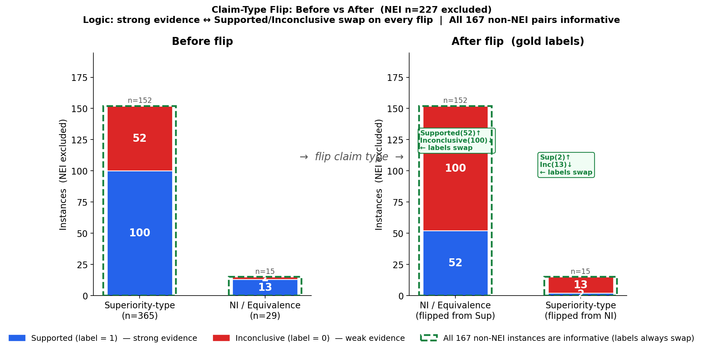

# KATA: Know Your Agent Through Adversarial Clinical Attack
Boya Zhang, 13 Mar 2026

# Roadmap

## 1. Motivation

### 1.1 LLMs as clinical agents

[**OpenClaw**](https://openclaw.ai/) is the fastest-growing open-source
agentic AI framework. It runs an LLM as the
autonomous reasoning core of a persistent agent with no human in the loop.

Healthcare is already one of its primary deployment targets. The library
[**OpenClaw-Medical-Skills**](https://github.com/FreedomIntelligence/OpenClaw-Medical-Skills) (869 curated skills) packages
specialised capabilities for agent for clinical application.

### 1.2 Aims

[**CliniFact**](https://www.nature.com/articles/s41597-025-04417-x) established a benchmark of 1,970
clinical research claim instances across 992 trials, demonstrating that discriminative
models (BioBERT: 80.2% accuracy) outperform generative LLMs (Llama3-70B: 53.6%) under
clean conditions. But clean-condition accuracy is not sufficient for agent deployment.

A critical capability remains untested: **Can LLMs correctly interpret the same evidence when the clinical claim type changes?**

| Claim type | Evidence: "HR = 0.97, p = 0.62" | Correct label |
|---|---|---|
| Superiority: "Drug A is superior to Placebo" | Similar performance doesn't prove superiority | **Inconclusive (0)** |
| Non-inferiority (NI): "Drug A is non-inferior or equivalent to Placebo" | Similar performance is what NI requires | **Supported (1)** |

We aim to evaluate the reasoning ability of LLM agents across contrastive clinical claim types.


---

## 2. Research Questions

| # | Question | Deployment relevance |
|---|----------|---------------------|
| **RQ1** | Do LLMs correctly distinguish between superiority and non-inferiority claims using the same evidence? | Core reliability requirement for any clinical agent |
| **RQ2** | What failure modes appear in the model's reasoning when it maintains the wrong verdict? | Informs which errors are catchable by downstream audit vs. silent |
| **RQ3** | Which model (close-source / open-source) (reasoning / non-reasoning) is most robust to this framing change? | LLM selection guidance for agentic clinical skill deployment |

---

## 3. Source Data and Contrast Set Construction

### 3.1 Source Data

We use exclusively the **gold-standard test set** of CliniFact (n = 394 instances across
394 unique trials). CliniFact claims follow a fixed template derived from structured
trial fields:

```
{intervention} is {claim_type_phrase} to {comparator} in terms of {outcome_title}
```

The `nonInferiorityTypes` column records the trial design per outcome
(Superiority, Superiority or Other, Non-Inferiority, Non-Inferiority or Equivalence,
Equivalence). All 394 instances can have their claim type flipped
by substituting the corresponding phrase in the claim string.

**Label scheme** (multi-class):

| Numeric | Name | Meaning |
|---------|------|---------|
| **1** | **Supported** | Evidence supports the claim (n = 113, 28.7%) |
| **0** | **Inconclusive** | Evidence does not support the claim (n = 54, 13.7%) |
| **2** | **NEI** | Not enough information to evaluate (n = 227, 57.6%) |


### 3.2 Claim-Type Flip: Constructing Minimal Contrast Pairs

Each instance in the test set is paired with a **minimally perturbed counterpart**:
the claim type phrase is flipped (superiority ↔ non-inferiority/equivalence), while
the evidence abstract remains unchanged.

**Claim phrase normalisation** (applied as a preprocessing step):

Raw CliniFact claims contain the phrase "superior or other" for the 192 instances
whose `nonInferiorityTypes` is `Superiority or Other`. This phrase is a
ClinicalTrials.gov registry artifact and does not appear in any clinical publication.
It is normalised to "superior" before flipping, producing standard clinical language.

Similarly, all superiority-type instances flip to the phrase "non-inferior or
equivalent" (an FDA-recognised phrase covering both one-sided NI and two-sided
equivalence designs), so every corrupted claim across the 365 superiority-type
instances uses the same phrase. This makes the contrast set internally consistent.

**Merged NIT groups and flip mapping:**

| Group | Raw NIT values (ClinicalTrials.gov) | Claim phrase (after normalisation) | Flips to |
|---|---|---|---|
| **Superiority-type** (n=365) | Superiority, Superiority or Other | "is superior to" | "is non-inferior or equivalent to" |
| **Non-inferiority / Equivalence** (n=29) | Non-Inferiority, Non-Inferiority or Equivalence, Equivalence | "is non-inferior to" / "is non-inferior or equivalent to" / "is equivalent to" | "is superior to" |

### 3.3 Gold Label Derivation

Labels are derived from the logic in `claim_flip_logic.md`. The core principle:

> Superiority is a **strong** claim ("A is clearly better") and NI/Equivalence is a
> **weak** claim ("A is not worse, or similar"). The same evidence has *opposite*
> implications for each claim type.

| Evidence strength | Superior claim label | NI / Eq claim label | Flip effect |
|-------------------|---------------------|---------------------|-------------|
| **Strong** (A clearly better than B) | Supported (1) | **Inconclusive (0)** | ✦ 1 → 0 |
| **Weak** (A similar to B, small/no effect) | Inconclusive (0) | **Supported (1)** | ✦ 0 → 1 |
| **Absent** (outcome not reported) | NEI (2) | NEI (2) | — |

**Rule: Supported ↔ Inconclusive always swap on any flip direction. NEI is invariant.**

This means **all 167 non-NEI instances are informative** — every flip changes the
gold label. See `claim_flip_quadrant.html` for the interactive 2×2 diagram.

**Implementation:** `corruption/column_based.py → derive_claim_type_corrupted_label()`

### 3.4 Coverage and Informativeness

The figure below shows the label distribution across trial types before and after the
flip (NEI n=227 excluded — unchanged by flip).



Applying the flip to all 394 instances yields:

| Category | n | Description |
|---|---|---|
| **Informative pairs** | **167** | All non-NEI instances — label always swaps on flip |
| NEI pairs (unchanged) | 227 | Not enough information; claim type doesn't affect label |
| **Total** | **394** | All 100% flippable (no instances lost) |

**Breakdown of informative pairs by flip direction:**

| Original group | Original label | Flipped label | Count |
|---|---|---|---|
| Superiority-type → NI/Eq | **Supported (1)** | **Inconclusive (0)** | **100** |
| Superiority-type → NI/Eq | **Inconclusive (0)** | **Supported (1)** | **52** |
| NI/Eq → Superiority-type | **Supported (1)** | **Inconclusive (0)** | **13** |
| NI/Eq → Superiority-type | **Inconclusive (0)** | **Supported (1)** | **2** |

> **Dataset note:** 93% (365/394) of CliniFact test instances are superiority-type
> trials, reflecting the real-world distribution of RCT literature. This imbalance
> is an inherent property of the source data and is flagged as a limitation.

---

## 4. Experimental Design

### 4.1 Paired Evaluation Protocol

Each model is evaluated on the same instance **twice**: once with the original claim
(Condition B) and once with the flipped claim (Condition C). The evidence is
identical in both runs.

```
Condition B:  Original claim  + Original evidence
              → Clean baseline; establishes whether the model can fact-check correctly

Condition C:  Flipped claim   + Original evidence
              → Framing-changed probe; tests whether the model updates its verdict
              → Corrupted claim phrase: "is non-inferior or equivalent to" (Sup→NI)
                                   or "is superior to" (NI→Sup)
```

Condition A (claim only, no evidence) is run once on the original claim to establish
the parametric-knowledge baseline.

On the **167 informative pairs**, the expected verdict always flips:

| Direction | Condition B (original) | Condition C (flipped) | Framing-blind error |
|-----------|----------------------|-----------------------|---------------------|
| Sup → NI (100 pairs) | Supported (1) | **Inconclusive (0)** | Predicts Supported on C |
| Sup → NI (52 pairs) | Inconclusive (0) | **Supported (1)** | Predicts Inconclusive on C |
| NI → Sup (13 pairs) | Supported (1) | **Inconclusive (0)** | Predicts Supported on C |
| NI → Sup (2 pairs) | Inconclusive (0) | **Supported (1)** | Predicts Inconclusive on C |

A model that correctly flips its verdict on all 167 pairs demonstrates genuine
understanding of the statistical framing distinction.

### 4.2 What a Framing-Blind Model Looks Like

```
Evidence:  "HR = 0.97, 95% CI [0.82–1.10], p = 0.62. No statistically
           significant difference was observed."

Condition B claim:  "Drug A is superior to Placebo"
Correct answer:      Inconclusive (0) ✓
Model reasoning:    "p = 0.62, no significant difference → drug not shown to be
                     superior → Inconclusive"

Condition C claim:  "Drug A is non-inferior or equivalent to Placebo"
Correct answer:      Supported (1) ✓
Correct reasoning:  "p = 0.62, similar performance → drug is within equivalence
                     bounds → non-inferiority is supported → Supported"

Framing-blind model: Inconclusive (0) ✗
Confused reasoning: "p = 0.62, no significant difference → claim not supported
                     → Inconclusive"
                    (applies superiority-trial logic to an NI claim)
```

The key insight: **"no significant difference" has opposite implications** depending
on the claim type.
- For superiority: "no difference" → the drug hasn't proved it's *better* → Inconclusive
- For non-inferiority: "no difference" → the drug has proved it's *not worse* → Supported

A model that treats both identically is applying only one inferential framework.

### 4.3 Agent Output Format

```json
{
  "label": "Supported | Inconclusive | Not enough info",
  "confidence": 0–100,
  "reasoning": "step-by-step explanation"
}
```

### 4.4 Models

| Model | Type | Total Parameters |
|-------|------|-----------------| 
| [**Claude Haiku 3**](https://platform.claude.com/docs/en/home) | Anthropic | - |
| [**gpt-5-nano**](https://developers.openai.com/api/docs/pricing?latest-pricing=standard) | OpenAI | - |
| [**DeepSeek-V3.2**](https://api-docs.deepseek.com/quick_start/pricing) | DeepSeek | 685B (671B main + 14B MTP) |
| [**MiniMax-M2.5**](https://platform.minimax.io/docs/guides/pricing-paygo) | MiniMax | 230B (10B active/token) |

### 4.5 Prompt Strategy

Two strategies per model:

- **Zero-shot**: Task description + input only
- **Few-shot** (3 examples): One example per label class, each demonstrating
  correct reasoning about when "no significant difference" supports vs. fails a claim

---

## 5. Evaluation

### 5.1 Primary Metrics

| Metric | Description |
|--------|-------------|
| **Accuracy on B** | Baseline|
| **Accuracy on C** | Accuracy after framing flip |
| **Success rate** | % % of pairs where model detects the change in logic |
| **Failure rate** | % of pairs where model fails to detect the change in logic |

**Sanity check on 227 NEI pairs:** model should predict NEI on both B and C
(unchanged by flip); large variation here indicates general instability.

### 5.2 Secondary Metrics — Reasoning Quality

Accuracy alone cannot distinguish whether a model *understands* the framing change
or simply guesses correctly. Reasoning analysis provides mechanistic evidence.

#### Rule-based signal extraction

Applied to every Condition B and C prediction:

| Signal | What it measures |
|--------|-----------------|
| `claim_type` | Does reasoning engage with the framing of the claim? |
| `cites_evidence` | Does reasoning cite a p-value, CI, or effect size? |


#### Human/LLM evaluation

Each incorrect Condition C prediction is classified into one failure mode:

| Mode | Definition |
|------|------------|
| **FRAMING BLIND** | Model predicts same label even though the claim logic has changed |
| **EVIDENCE BYPASS** | No evidence cited - model relies on parametric knowledge|
